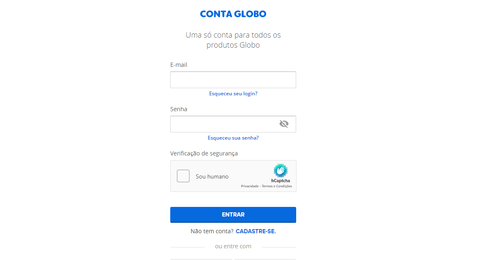
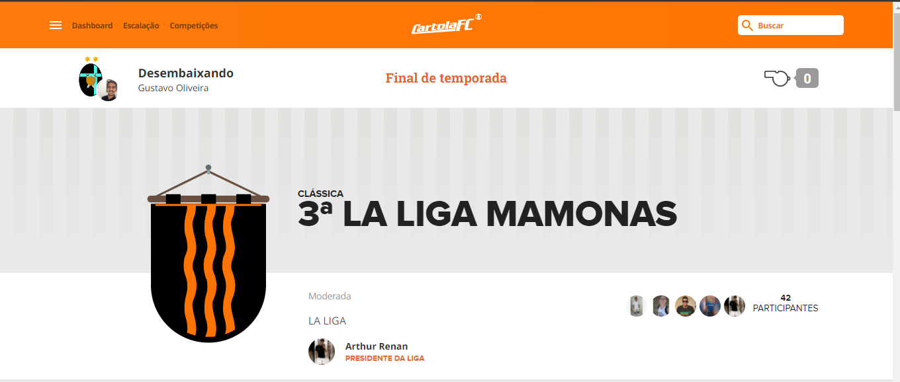
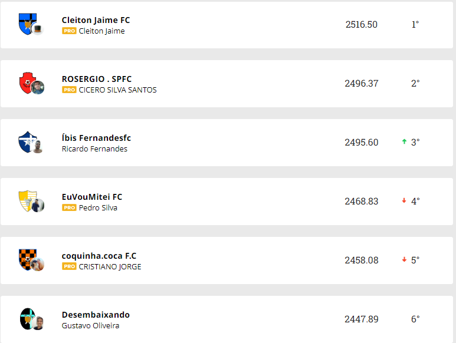
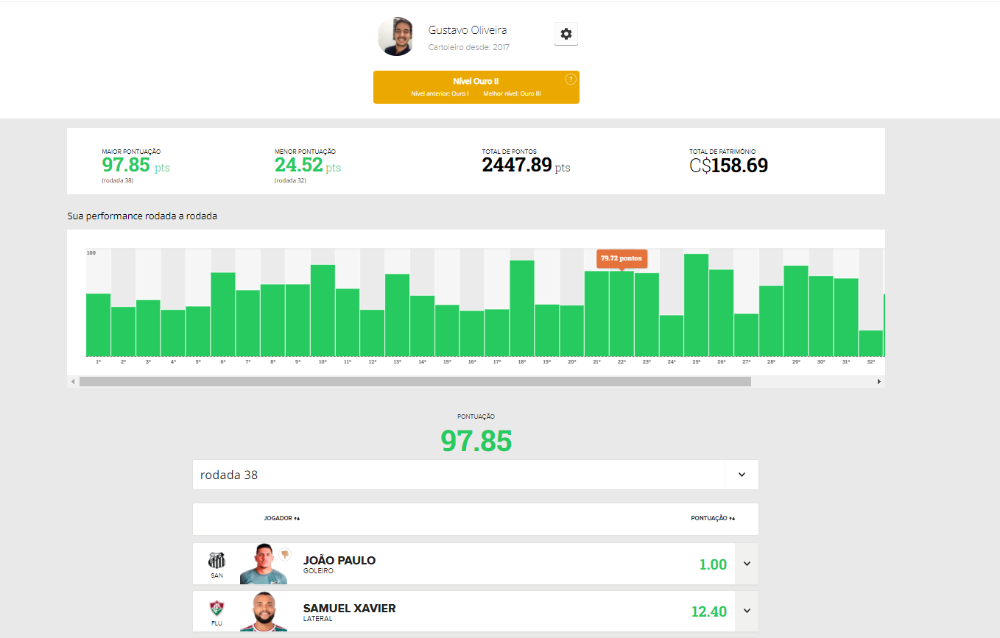

#    Web Scraping Cartola FC      

## Problema a ser resolvido: 
Após o fim do Campeonato Brasileiro de Futebol de 2021, os organizadores de uma liga do jogo promovido pela Globo, chamado [Cartola FC](https://cartolafc.globo.com/), lembraram que não haviam anotado quais foram os vencedores de tais rodadas, turnos, meses, e eles precisariam desses resultados pois precisavam pagar a premiação dos vencedores. Para verificar as pontuações seria necessário entrar no perfil de cada membro da **liga** e verificar rodada por rodada, anotando as pontuações de cada um, contudo devido isso ser bem trabalhoso, fiz um algoritmo para que resolvesse tudo isso sozinho.

___
## Recursos utilizados:
- Biblioteca Selenium
- Biblioteca Beautiful Soup
- Biblioteca Pandas

___
## Passo a passo executado:
- [X] Acessar página do cartola
  

- [X] Fazer login
- [X] Acessar página da liga
  

- [X] Coletar os dados dos jogadores

- [X] Acessar o perfil de cada um, e obter a pontuação em cada rodada

- [X] Fazer as análises necessárias
